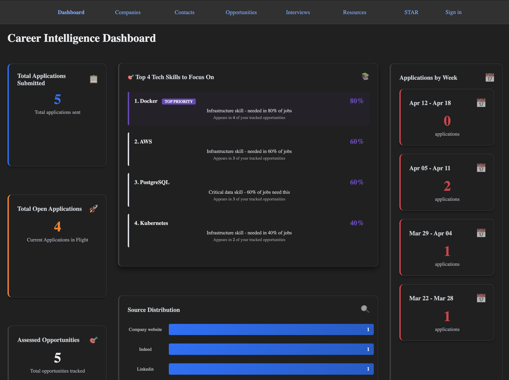

# Career Intelligence

A Rails 8 application for tracking, analyzing, and strategizing a job search. Built to centralize opportunity tracking, interview preparation, technology demand analysis, and career narrative development — turning raw job search activity into actionable intelligence.

**Live:** [https://mycareerintel.com](https://mycareerintel.com)

> **Portfolio context:** This project demonstrates AI-assisted rapid development workflow — building a working, data-driven solution to a real automation need using modern Rails conventions.



<!-- Replace the above with an actual screenshot of the dashboard -->

---

## Features

- **Dashboard Analytics** — Role distribution, technology demand trends, weekly application tracking, and open/assessed/response metrics
- **Opportunity Tracking** — Full CRUD with filtering, sorting across 10+ columns, salary range standardization, and fit/trajectory/bus-factor scoring
- **Multi-Role System** — Role-specific metadata via JSONB with concern modules for Software Engineer, Sales Engineer, Solutions Engineer, Product Manager, Support Engineer, and Success Engineer
- **Technology Demand Analysis** — 75 tracked technologies across 6 categories with combination analysis, pairing insights, and learning priority recommendations
- **Company & Contact Management** — Track target companies with market analysis fields, contacts with automatic URL shortening
- **Interview Session Tracking** — Stage/format/status tracking, confidence scoring, signal assessment, and follow-up management
- **STAR Story Library** — Categorized stories with strength scoring, usage tracking, and outcome linking to opportunities
- **Resource Sheets & Interview Guides** — Auto-generated prep sheets from opportunities, plus behavioral, technical, interviewer, and acquired question guides
- **CSV Exports** — Export opportunities, interview sessions, and STAR stories for external analysis
- **Demo Mode** — Read-only access for unauthenticated visitors to explore the app without an account
- **PWA Support** — Installable as a mobile app with service worker caching, web app manifest, and offline-ready static assets
- **Responsive Design** — Mobile-friendly layouts with adaptive dashboard grid, responsive table column visibility, and sticky table headers
- **CI/CD Pipeline** — Brakeman security scanning, RuboCop linting, importmap audit, and RSpec test suite via GitHub Actions

---

## Tech Stack

| Layer           | Technology                                            |
| --------------- | ----------------------------------------------------- |
| Framework       | Ruby on Rails 8.0.3                                   |
| Language        | Ruby 3.4.6                                            |
| Database        | PostgreSQL                                            |
| Authentication  | Devise 5.0                                            |
| Frontend        | Hotwire (Turbo + Stimulus), Importmap, Tailwind CSS 4 |
| Asset Pipeline  | Propshaft                                             |
| Background Jobs | Solid Queue                                           |
| Caching         | Solid Cache                                           |
| WebSockets      | Solid Cable                                           |
| Testing         | RSpec, Shoulda Matchers, Factory Bot, Capybara        |
| Security        | Brakeman                                              |
| Linting         | RuboCop (Rails Omakase)                               |
| Error Tracking  | Sentry (sentry-rails)                                 |
| Error Tracking  | Honeybadger                                           |
| Observability   | AppSignal (performance monitoring)                    |
| N+1 Detection   | Bullet (development only)                             |
| Deployment      | Docker, AWS (EC2, RDS, ALB, ECR, Route 53, ACM, SSM)  |

---

## Prerequisites

- Ruby 3.4.6
- PostgreSQL 14+
- Node.js (for asset compilation, if needed)
- Bundler

---

## Setup

### 1. Clone the repository

```bash
git clone https://github.com/ntxtthomas/career_intelligence.git
cd career_intelligence
```

### 2. Install dependencies

```bash
bundle install
```

### 3. Configure environment variables

Create a `.env` file in the project root. Registration is disabled — the owner account is created via `db:seed` using these credentials:

```dotenv
OWNER_EMAIL=your_email@example.com
OWNER_PASSWORD=your_secure_password
```

> The database defaults in `config/database.yml` should work without additional configuration for most local PostgreSQL setups. Only add `DATABASE_*` variables if your setup differs.

### 4. Set up the database

```bash
bin/rails db:create
bin/rails db:migrate
bin/rails db:seed
```

Seeding creates an owner user (from your `.env` values), a demo user, and 75 technologies across 6 categories with sample demo data.

### 5. Start the server

```bash
bin/dev
```

Visit `http://localhost:3000` to access the dashboard.

---

## Running Tests

```bash
bundle exec rspec
```

The CI pipeline also runs on every PR and push to `main`:

| Job         | Description                                                              |
| ----------- | ------------------------------------------------------------------------ |
| `scan_ruby` | Brakeman security analysis                                               |
| `scan_js`   | Importmap dependency audit                                               |
| `lint`      | RuboCop style enforcement                                                |
| `test`      | Full RSpec suite with PostgreSQL service                                 |
| `deploy`    | Build & push Docker image to ECR, deploy to EC2 via SSM (manual trigger) |

---

## Project Structure

```
app/
├── controllers/        # RESTful controllers for all resources
├── models/
│   ├── concerns/
│   │   └── role_types/ # Multi-role concern modules (SE, Sales, Solutions, PM, etc.)
│   └── ...             # Domain models (Opportunity, Company, Contact, etc.)
├── services/           # TechStackAnalyzer, RoleFocusAnalyzer, CSV exporters
├── views/              # ERB templates with role-specific form partials
└── docs/               # Internal engineering documentation
```

---

## Roadmap

A summary of planned enhancements — see the [Roadmap wiki page](../../wiki/Roadmap-&-Future-Enhancements) for details.

- [x] PWA for mobile access
- [x] Responsive design for smaller screens
- [x] Dockerized deployment (AWS EC2 + Docker)
- [x] Public deployment — [mycareerintel.com](https://mycareerintel.com)
- [x] Enhanced GitHub Actions CI/CD (SSM deploy with manual trigger)
- [ ] Improved sign-in page UI
- [ ] RAG/VectorDB for refined data analysis
- [ ] Wins tracking system
- [ ] GraphQL endpoint

---

## Wiki

For deeper documentation, see the [GitHub Wiki](../../wiki):

- [Architecture & Technical Design](../../wiki/Architecture-&-Technical-Design)
- [Features & Usage Guide](../../wiki/Features-&-Usage-Guide)
- [Data-Driven Job Search Strategy](../../wiki/Data-Driven-Job-Search-Strategy)
- [Roadmap & Future Enhancements](../../wiki/Roadmap-&-Future-Enhancements)

---

## License

This project is licensed under the [MIT License](LICENSE).

---

## Author

**Terry Thomas** — [apm.tthomas@gmail.com](mailto:apm.tthomas@gmail.com)
